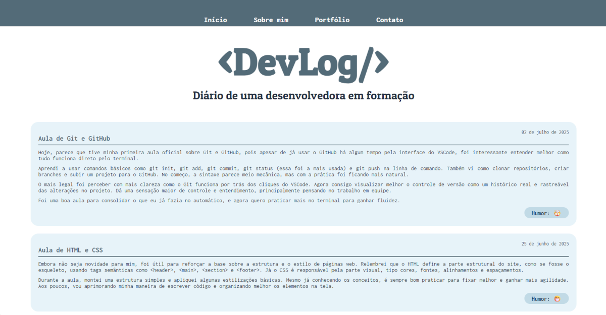
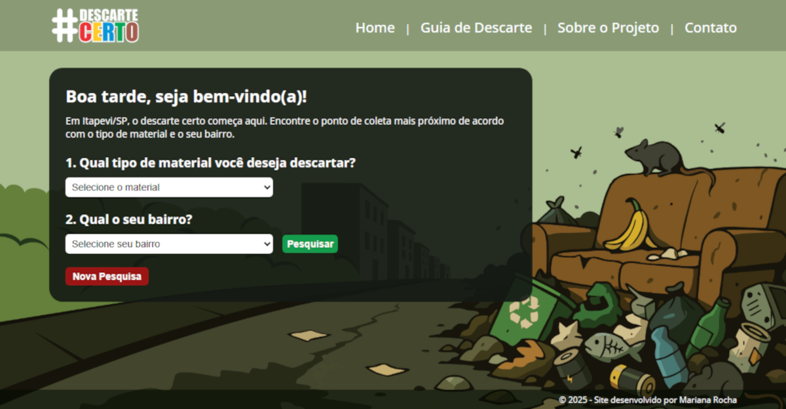
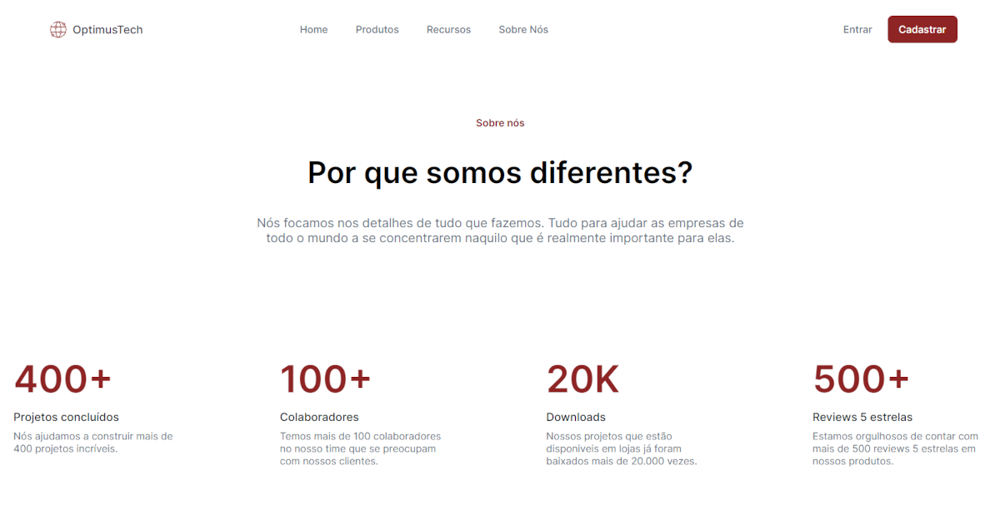
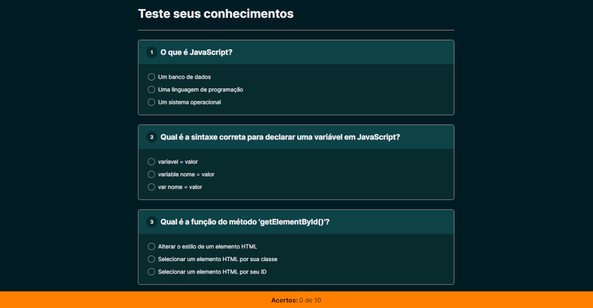
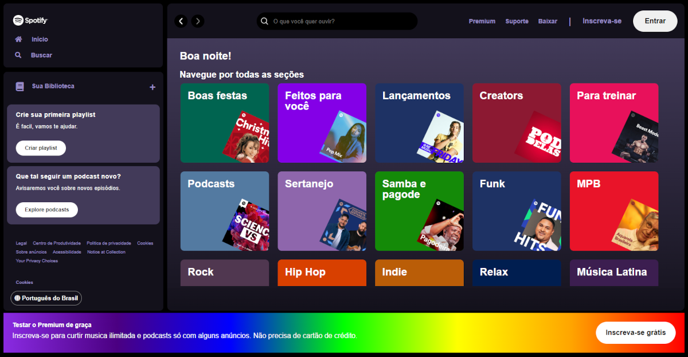

# Olá, meu nome é Mariana Rocha!

## Sobre mim

Sou estudante de Análise e Desenvolvimento de Sistemas, em constante evolução e determinada a me tornar uma Desenvolvedora Full Stack. Atualmente, em transição de carreira, tenho investido em cursos práticos, imersões técnicas e projetos reais para construir uma base sólida em Lógica de Programação, Desenvolvimento Web e Desenvolvimento de Software.

Com mais de 15 anos de experiência na área de arquitetura, desenvolvi um olhar apurado para detalhes, organização e gestão de projetos, habilidades que pretendo aplicar na criação de soluções digitais eficientes, funcionais e bem estruturadas.

## Habilidades

### Linguagens e Tecnologias

### Ferramentas / Sistema Operacional

## GitHub Stats

## Repositórios Recentes

  
  
   
  
  
  

## Conecte-se comigo

